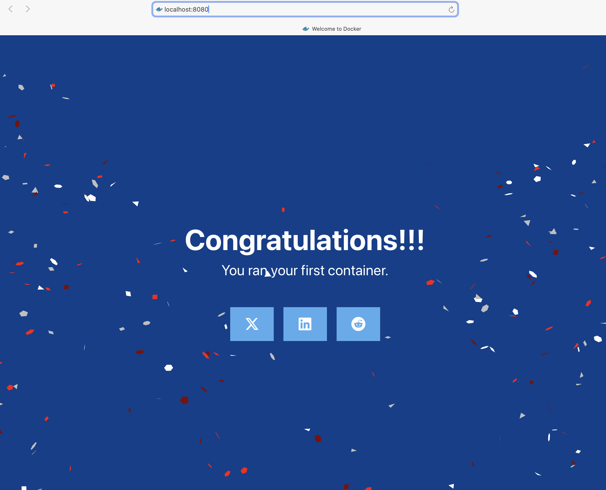

# Lab 01 — Welcome to Docker

This is my first hands-on Docker exercise. I ran the official welcome image and exposed its web interface on port 8080.

## Objective

Run a Docker container and access a web application from my local machine.

## Command

```bash
docker run -d -p 8080:80 docker/welcome-to-docker
```

Explanation:
* docker run creates and starts a container
* -d runs the container in detached mode
* -p 8080:80 maps port 8080 on my machine to port 80 inside the container
* docker/welcome-to-docker is the Docker welcome image

## Result

The container started successfully and the application was accessible at:

http://localhost:8080



To stop the container, first I find its ID:
```bash
docker ps
```

Then I stop it with the command:
```
docker stop <container-id>
```

## What I learned

* A container runs an application in an isolated environment.
* Docker can download an image if it is not available locally.
* Port mapping makes a containerized web application accessible from my computer.
* `docker ps` shows running containers.
* `docker stop` stops a running container.

## Next step

Continue the official Docker Get Started tutorial and learn how to build and run my own containerized application.
