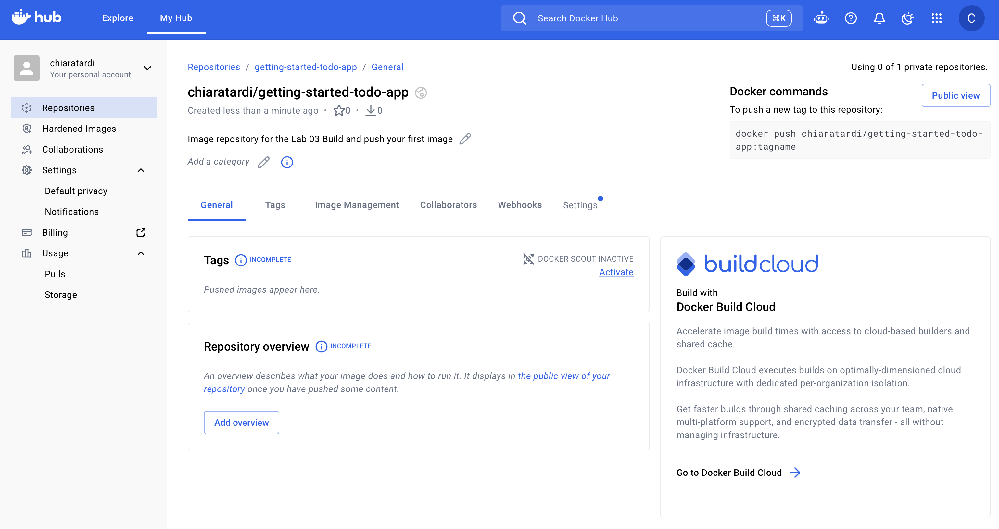
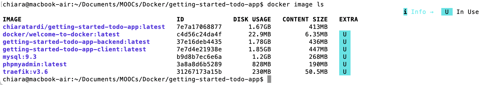
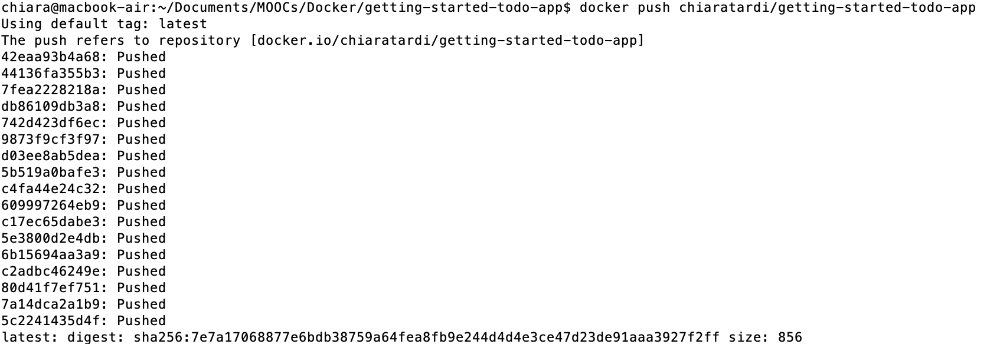
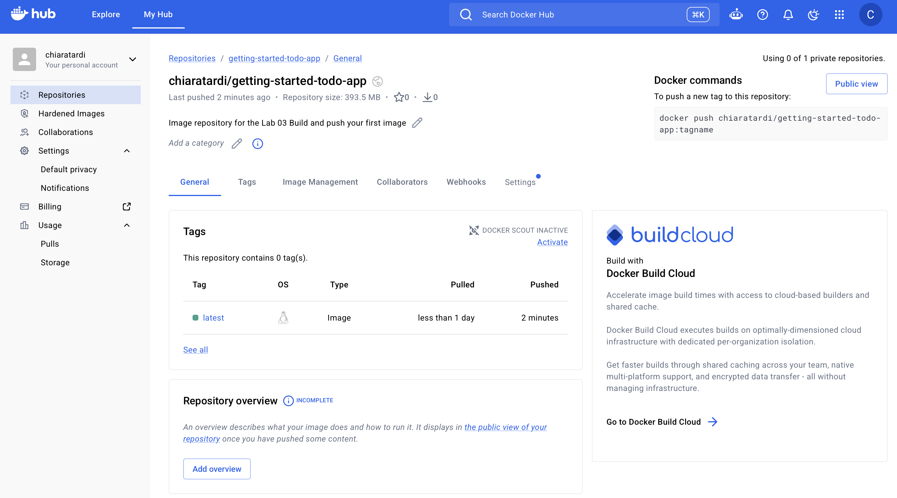

# Lab 03 — Build and Push an Image on Docker Hub

## Objective

Learn how to build a Docker image from a Dockerfile and push it to Docker Hub.

## What I practiced

* Signed in to Docker Hub.
* Created a public image repository.
* Built an image from the to-do application.
* Verified the image locally.
* Pushed the image to Docker Hub.

## Commands

```bash
git clone https://github.com/docker/getting-started-todo-app
cd getting-started-todo-app
docker build -t <DOCKER_USERNAME>/getting-started-todo-app .
docker image ls
docker push <DOCKER_USERNAME>/getting-started-todo-app
```

## Results

### Image repository in Docker Hub

First, I manual created an image repository called `getting-started-todo-app` on my [Docker Hub](https://hub.docker.com) account.



### Image build



### Push Image in Docker Hub





## What I learned

A Docker image packages an application and its dependencies. Docker Hub can be used to store and share images. <Cite ref="turn0view0" />

## Next step

Learn why developers use Docker in their daily workflow and continue building practical experience.
