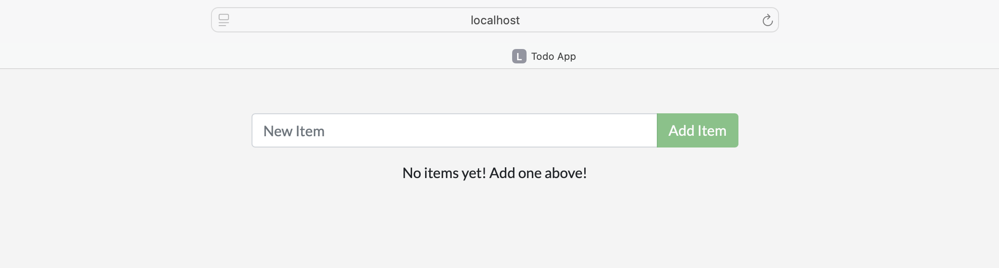
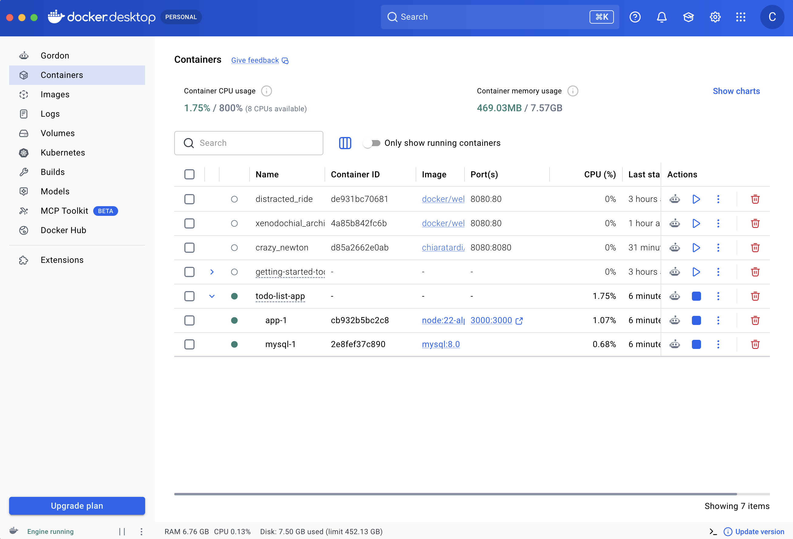

# Lab 05 — Docker Compose

## Objective

I learnt how to use Docker Compose to run a multi-container application with a Node.js frontend and MySQL database.

## What I practiced

* Cloned the sample to-do application.
* Explored the `compose.yaml` file.
* Started the application with Docker Compose.
* Accessed the application in a browser.
* Added, completed, and removed to-do items.
* Stopped and removed the application stack.

## Commands

```bash
git clone https://github.com/dockersamples/todo-list-app
cd todo-list-app
docker compose up -d --build
docker compose down
docker compose down --volumes
```

## Results

On a terminal I clone the repository `https://github.com/dockersamples/todo-list-app` and build the docker compose.

```bash
chiara$ git clone https://github.com/dockersamples/todo-list-app 
Cloning into 'todo-list-app'...
remote: Enumerating objects: 96, done.
remote: Total 96 (delta 0), reused 0 (delta 0), pack-reused 96 (from 1)
Unpacking objects: 100% (96/96), done.
Checking connectivity... done.
```

```bash
chiara$ cd todo-list-app/
chiara@macbook-air:~/Documents/MOOCs/Docker/todo-list-app$ docker compose up -d --build
[+] up 24/24
 ✔ Image mysql:8.0                      Pulled                                                                                          26.1s
 ✔ Image node:22-alpine                 Pulled                                                                                          22.6s
 ✔ Network todo-list-app_default        Created                                                                                          0.0s
 ✔ Volume todo-list-app_todo-mysql-data Created                                                                                          0.0s
 ✔ Container todo-list-app-mysql-1      Started                                                                                          0.5s
 ✔ Container todo-list-app-app-1        Started                                                                                          6.1s
```

I opened the application at `http://localhost:3000`



At the Docker Desktop GUI, I can see the containers and dive deeper into their configuration.



To stop the application:

```bash
chiara$ docker compose down
[+] down 3/3
 ✔ Container todo-list-app-app-1   Removed                                                                                               0.4s
 ✔ Container todo-list-app-mysql-1 Removed                                                                                               3.1s
 ✔ Network todo-list-app_default   Removed                                                                                               0.1s
```

To remove the containers and database volume:

```bash
chiara$ docker compose down --volumes
[+] down 1/1
 ✔ Volume todo-list-app_todo-mysql-data Removed                                                                                          0.0s
```

## What I learned

Docker Compose makes it easier to manage multiple containers as a single application. 
A `compose.yaml` file defines the services and their configuration, while `docker compose up` starts the application 
and `docker compose down` removes the containers and network. Volumes can preserve database data between restarts.
